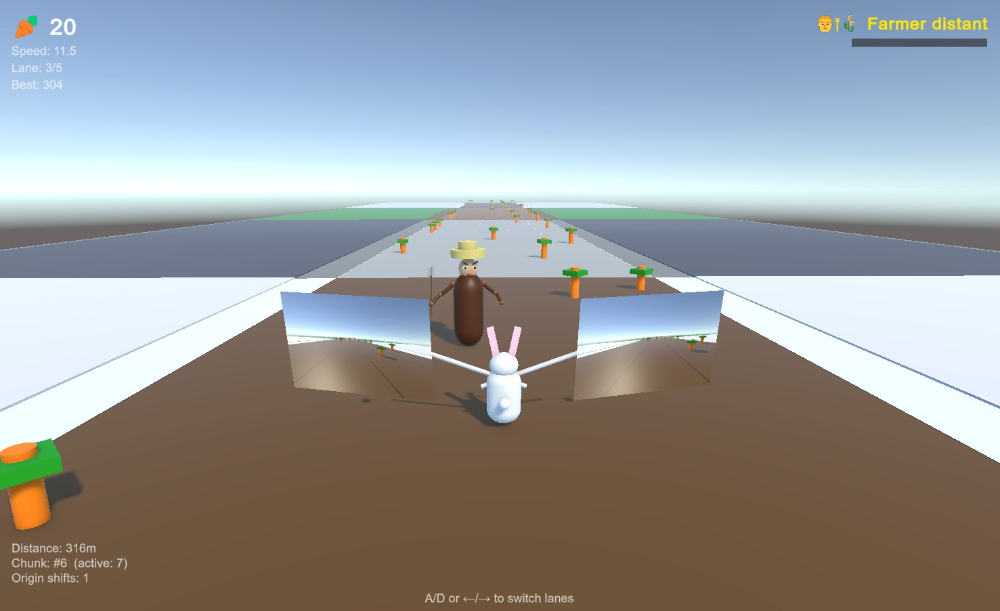

# 🥕 Reverse Rabbit Runner

> *Run backwards. Trust your mirrors. Steal ALL the carrots.*

**Reverse Rabbit Runner** is an endless runner with a twist — your rabbit runs **backwards** through a carrot farm, holding tiny mirrors in its paws (yes, like car side mirrors) to see where it's going. Meanwhile, an extremely angry farmer is chasing you down because, well, you're stealing his carrots.

It's as chaotic as it sounds. 🐇💨

---

## 🎮 The Game

Think of your favourite **endless runner game** — now imagine running the wrong way with only mirrors to guide you.

You're a rabbit. You run backwards through an endless carrot farm. You have two mirrors strapped to your long ears — that's your only view of what's behind you (which is actually ahead of you, because you're running backwards... keep up).

### Core Mechanics

- **🔄 Backwards Running** — The rabbit always faces the farmer. Your path ahead? That's behind you. Check your mirrors.
- **🪞 Paw Mirrors** — The rabbit holds side-mirror cameras in its paws, giving you a limited rear view. Adjust them with the numpad if things get hairy.
- **🥕 Carrot Collecting** — Dodge between 5 lanes to scoop up carrots for your high score.
- **👨‍🌾 Angry Farmer** — He's right there. In your face. Getting closer every time you hit something. If he catches you... it's not pretty.
- **🚧 Obstacles** — Farm equipment, fences, rocks — the usual stuff you'd find on a carrot farm that wants to kill you.

### Special Carrots (Power-Ups)

| Carrot | Effect |
|--------|--------|
| 🍼 **Birth-Carrot** | Instantly birth baby rabbits that spread across all lanes, hoovering up carrots. They'll slowly get picked off by obstacles and the farmer though. Circle of life. |
| 🪽 **Wing-Carrot** | Flip around and FLY! Glide forward (the right way for once) and grab airborne carrot lines. Brief taste of freedom. |
| 🤢 **Dirty-Carrot** | Smears your mirrors with mud. Even less visibility than before. Thanks, nature. |
| ❓ **More to come...** | We have ideas. Terrible, wonderful ideas. |

---

## 🛠️ Tech Stack

| Component | Details |
|-----------|---------|
| **Engine** | Unity 6.3 (6000.3.11f1) |
| **Render Pipeline** | URP (Universal Render Pipeline) |
| **Platforms** | PC + Mobile (iOS/Android) |
| **Input** | New Input System (keyboard + touch) |
| **AI Workflow** | GitHub Copilot + CoplayDev Unity MCP |

### Built With AI 🤖

This project is being developed with an **AI-assisted workflow** using **GitHub Copilot** as a coding partner and **Unity MCP** (Model Context Protocol) for real-time AI ↔ Unity Editor communication. The entire scaffolding, scripting, and scene setup was pair-programmed between a human developer and AI agents.

### AI-Generated Audio 🎶

All sound effects and music were generated locally using AI models via **ComfyUI**:

| Asset | Model | Details |
|-------|-------|---------|
| **Sound Effects** | Stable Audio Open 1.0 | 14 SFX clips — jump, collect, stumble, death stab, sad trombone game over, etc. |
| **Music Tracks** | AceStep v1 3.5B | 32 tracks (45s each) — electrofunk deep, electro house, and retro platformer styles |

No stock audio libraries. Every sound was prompted, generated, and curated in-house. 🎵

It's like having a tireless junior dev who never needs coffee but occasionally puts your game objects in the wrong scene. 😅

---

## 📸 Current State: Playable Prototype

> ⚠️ **This is a playable prototype.** Characters are made of Unity primitives (cubes, spheres, cylinders). Art is placeholder. Gameplay is functional with full audio.

<p align="center">
  
  <br><em>Primitive art, but the rabbit runs, the farmer rages, and the music slaps.</em>
</p>

### What Works ✅

- 🐇 Backwards-running rabbit with primitive body, face, ears, and arms holding mirrors in its paws
- 🪞 Working mirror cameras (RenderTexture-based, adjustable with numpad, follows all rabbit movement including tilt)
- 👨‍🌾 Angry farmer with hat, pitchfork, scowling face, and AI pursuit
- 🥕 Carrot collecting with score tracking and bobbing animation
- 🛤️ 5-lane switching (A/D or arrow keys)
- 🦘 Jump mechanic (Space) — clear obstacles and collect mid-air carrots
- 🌍 Chunk-based infinite world with 3 themed biomes (Concrete, Snow+Mud, Grass)
- 🔄 Origin shifting for unlimited distance without floating-point issues
- 🚧 4 obstacle types (farm crates, round hay bales, fence posts, scarecrows) with stumble mechanic
- 📈 Difficulty ramp — obstacles increase, farmer gets faster over time
- 🚜 Tractor flatbed platforms — jump on top for a carrot jackpot (~100+ bonus carrots!)
- 💀 Dramatic 7-stage cinematic death sequence (orbit camera, blood/carrot particles, fork stab)
- 🔊 Full SFX system — 14 AI-generated sound effects (jump, land, collect, stumble, death, game over, danger warning, etc.)
- 🎵 Music player — 32 AI-generated tracks with shuffled playback and crossfade transitions
- 🎛️ Settings panel with Master, SFX, and Music volume sliders (saved to PlayerPrefs)
- ⏸️ Pause menu (Esc/Q) with Resume, Settings, and Quit to Menu
- 🏠 Main Menu scene with Play, Settings, and Quit
- 📊 HUD showing score, speed, lane, farmer threat, distance, and chunk stats

### What's Coming 🚧

- [ ] Power-up implementations (Birth / Wing / Dirty carrots)
- [ ] More platform types (hay bale row, stone wall, log pile)
- [ ] Character model upgrades (goodbye, primitive art)
- [ ] Animations (running, jumping, stumble, farmer rage)
- [ ] Mobile touch input polish
- [ ] Leaderboard / high score persistence

---

## 🚀 Getting Started

### Prerequisites

- **Unity 6.3** (6000.3.11f1 or later)
- **Git** (for cloning)

### Setup

```bash
git clone git@github.com:AntonSigur/RRR-ReverseRabbitRunner.git
```

1. Open the project in Unity Hub
2. Open `Assets/Scenes/MainMenu.unity`
3. Run **ReverseRabbitRunner → Create Main Menu Scene** (from the top menu)
4. Open `Assets/Scenes/SampleScene.unity`
5. Run **ReverseRabbitRunner → Setup Game Scene**
6. Press **Play** from the MainMenu scene

### Controls (PC)

| Key | Action |
|-----|--------|
| `A` / `D` or `←` / `→` | Switch lanes |
| `Space` | Jump |
| `Numpad 4/6` | Rotate both mirrors (yaw) |
| `Numpad 7/9` | Rotate left/right mirror individually |
| `Numpad 8/2` | Tilt mirrors (pitch) |
| `Numpad +/-` | Zoom mirrors |
| `Numpad 5` | Reset mirrors |
| `Esc` or `Q` | Pause / Resume |
| `Shift+3` | Skip music track *(editor only)* |
| `Shift+4` | Toggle song name overlay *(editor only)* |

---

## 📁 Project Structure

```
Assets/_Project/
├── Scripts/
│   ├── Core/       → GameManager, ScoreManager, InputManager, AutoStartGame,
│   │                 AudioManager, MusicPlayer, DeathSequence
│   ├── Player/     → RabbitController, MirrorCamera, CameraFollow
│   ├── World/      → ChunkManager, LaneGenerator, ObstacleSpawner, CarrotBob
│   ├── Enemies/    → FarmerController, FarmerForkWave
│   ├── PowerUps/   → BirthCarrot, WingCarrot, DirtyCarrot (stubs)
│   ├── UI/         → GameHUD, MainMenuUI, PauseMenuUI
│   └── Editor/     → SceneSetup, MainMenuSceneSetup
├── Audio/
│   └── Music/      → Master music library (originals + generated/)
├── Prefabs/
├── Materials/
└── Textures/

Assets/Resources/
├── SFX/            → 14 FLAC sound effects (auto-loaded at runtime)
└── Music/          → 32 FLAC music tracks (auto-loaded by MusicPlayer)
```

---

## 👤 Team

**AntonSigur** and his agent team — a human-AI collaboration building games one carrot at a time.

---

## 📄 License

This project is licensed under the **MIT License** — see the [LICENSE](LICENSE) file for details.

---

<p align="center">
  <i>No rabbits were harmed in the making of this game.</i><br>
  <i>The farmer, however, is furious.</i> 🐇🥕👨‍🌾
</p>
